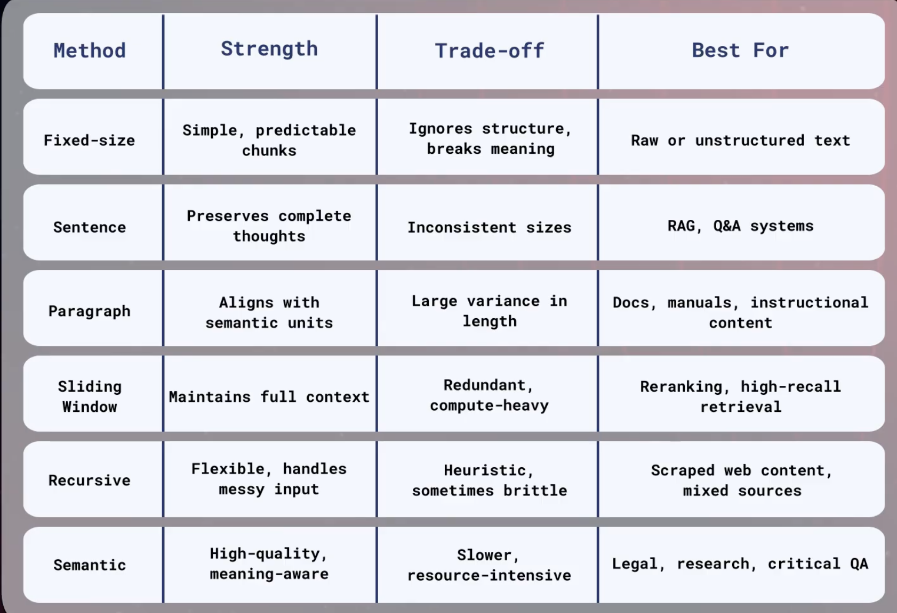

# Hyperparameter Decision Table for Chunking

Reference status: exploratory material supplied by the project owner on
2026-08-04. The table is preserved for later research and is not an approved
chunking default. Validate the methods and their tunable parameters against
representative project datasets before promoting a decision.

## Searchable Transcription

| Method | Strength | Trade-off | Best for |
|---|---|---|---|
| Fixed-size | Simple, predictable chunks | Ignores structure; breaks meaning | Raw or unstructured text |
| Sentence | Preserves complete thoughts | Inconsistent sizes | RAG and Q&A systems |
| Paragraph | Aligns with semantic units | Large variance in length | Documents, manuals, and instructional content |
| Sliding window | Maintains full context | Redundant and compute-heavy | Reranking and high-recall retrieval |
| Recursive | Flexible; handles messy input | Heuristic and sometimes brittle | Scraped web content and mixed sources |
| Semantic | High-quality and meaning-aware | Slower and resource-intensive | Legal, research, and critical QA |

## Later Experiment Questions

- Which method performs best for each document type represented in AskMyDocs?
- How do chunk size, overlap, minimum and maximum length, separators, and
  semantic breakpoints affect retrieval and answer quality?
- What are the latency, indexing, storage, and duplicate-context costs?
- Do method combinations outperform a single strategy for mixed documents?
